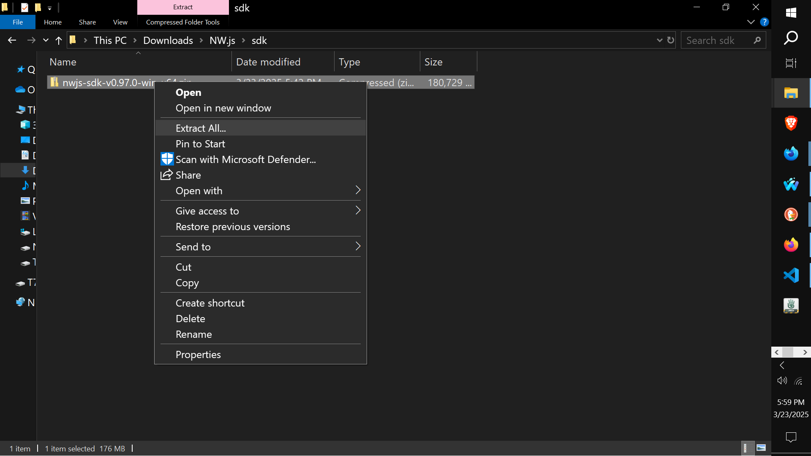
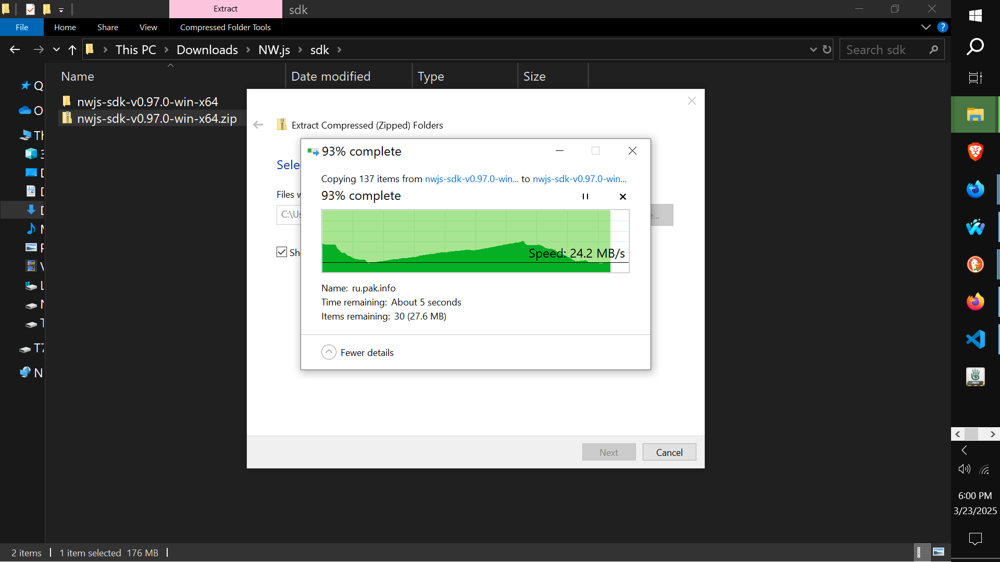

# CATopalian_JavaScript_NW.js
Create applications with HTML, CSS, JS, and Node.js together.

---

## Download NW.js
[Download NW.js](https://nwjs.io/)


We go to https://nwjs.io/ to Download NW.js.

## Two Versions
1. Normal (152mb)  
    * Smaller File Size
    * Used for running and distributing apps
    * No built-in devtools
2. SDK (176mb)
    * Bigger File Size
    * Includes Chromium DevTools
    * Lets us inspect and debug our app

### Download BOTH versions
* Create a Folder for Normal and put the Normal NW.js zip file there.
* Create a Folder for SDK version and put the SDK NW.js zip file there.


---


---

Let's focus on using SDK version.

## Extract SDK zip file
We have a zip file called 
```text
nwjs-sdk-v0.97.0-win-x64.zip
```

 We RIGHT CLICK on the zip file and choose EXTRACT ALL...







We see the nw.exe

# nw.exe
We run our app in testing phase by dropping our project folder ONTO this nw.exe executable icon

It will run our nw.js project, as long as we have our package.json set up correctly.

This is a quick way to run our app in testing phase. But, when we are ready to publish our app, we will export our nw.js as an executable file for Windows, Linux and Mac.

---

## Create a Project Folder
We create a New Folder  
We name the folder ourFirstApp  

---

## package.json
We create a package.json file to be able to use our nw.js app

package.json - we save this in ourFirstApp folder
```javascript
{
    "name": "our-first-nwjs-app",
    "main": "index.html",
    "window": {
        "width": 800,
        "height": 600
    }
}
```

---

## index.html
We create an index.html file  

index.html - we save this in ourFirstApp folder
```HTML
<!DOCTYPE html>
<html>
<head>
<title> Our First NW.js App </title>

<link rel = 'stylesheet' href = 'src/css/style001.css'>

<script src = 'src/js/1shortcuts/shortcuts.js'></script>

<script src = 'src/js/memory/getFreeRam.js'></script>

<script src = 'src/js/email/sendEmail.js'></script>

<script src = 'src/js/4make/makeInterface.js'></script>

<script src = 'src/js/whenLoaded/whenLoaded.js'></script>

</head>

<body onload = "whenLoaded();">

</body>

</html>
```

style001.css- we save this in  ourFirstApp, src, css
```css
/* style001.css */

body
{
    background-color: rgb(30, 30, 30);
    color: rgb(255, 255, 255);
}

button
{
    height: 25px;
}
```

ourFirstApp/src/js/1shortcuts/shortcuts.js
```javascript
// shortcuts.js

function ge(whichId)
{
    let result = document.getElementById(whichId);
    return result;
}

function ce(whichType)
{
    let result = document.createElement(whichType);
    return result;
}

function ba(whichElement)
{
    let result = document.body.append(whichElement);
    return result;
}

function cl(whichMessage)
{
    let result = console.log(whichMessage);
    return result;
}
```

ourFirstApp/src/js/4make/makeInterface.js
```javascript
// makeInterface.js

function makeInterface()
{
    let mainDiv = ce('div');
    ba(mainDiv);

    //-//

    let subDiv = ce('div');
    mainDiv.append(subDiv);

    //-//

    let ramContainer = ce('div');
    ramContainer.style.display = 'flex';
    ramContainer.style.flexDirection = 'row';
    ramContainer.style.alignItems = 'center'; // make button and text align neatly
    ramContainer.style.gap = '10px'; // add space between elements
    subDiv.append(ramContainer);

    //-//

    let ramTitle = ce("h1");
    ramTitle.textContent = "Ram";
    ramContainer.append(ramTitle);

    //-//

    let showFreeMemButton = ce("button");
    showFreeMemButton.textContent = "Check Free Memory";
    showFreeMemButton.style.flex = "0 1 auto"; // prevent the button from stretching
    showFreeMemButton.onclick = function()
    {
        ge('memory-info').textContent = getFreeRam();
    };
    ramContainer.append(showFreeMemButton);

    //-//

    let memoryInfo = ce("p");
    memoryInfo.id = "memory-info";
    memoryInfo.style.margin = "0"; // remove any extra margins
    ramContainer.append(memoryInfo);

    //-//

    let sendEmailButton = ce("button");
    sendEmailButton.textContent = "Send Email";
    sendEmailButton.onclick = function()
    {
        sendEmail();
    };
    ba(sendEmailButton);
}
```

ourFirstApp/src/js/email/sendEmail.js
```javascript
const nodemailer = require('nodemailer');

function sendEmail()
{
    let transporter = nodemailer.createTransport
    ({
        service: 'gmail', // use 'smtp.mailtrap.io' for testing
        auth: 
        {
            user: 'yourEmail@gmail.com',
            pass: 'yourAppPasswordIsDifferentThanNormalPassword' // app password
        }
    });

    let mailOptions = 
    {
        from: 'yourEmail@gmail.com',
        to: 'whoeverYouWant@gmail.com',
        subject: 'Hi. This is a test',
        text: 'Howdy. This is a test email'
    };

    transporter.sendMail(mailOptions, function(error, info)
    {
        if (error) 
        {
            console.log('Error:', error);
        } 
        else 
        {
            console.log('Email sent:', info.response);
        }
    });
}
```

ourFirstApp/src/js/memory/getFreeRam.js
```javascript
// getFreeRam.js

function getFreeRam()
{
    let os = require("os");

    // convert bytes to MB
    let freeMemory = os.freemem() / (1024 * 1024);

    let freeMemoryAdjusted = freeMemory.toFixed(2) + ' MB';

    return freeMemoryAdjusted;
}
```

ourFirstApp/src/js/whenLoaded/whenLoaded.js
```javascript
// whenLoaded.js

// npm install nodemailer

function whenLoaded()
{
    makeInterface();
}
```
---

## Folder Structure
Our Project folder should look like this:

ourFirstApp folder
  


src folder
  

js folder
  

---

Since we are using nodemailer in our application we have to make sure we install it before to using it.
### In our Command Prompt we type:  
npm install nodemailer  
Press Enter
  

---

Now that all of the files are in their correct folders and we have our required nodemailer installed, let's run our application:


# Run App
To Run the Application we:
1. Drag our project folder onto the nw.exe icon.

We Open the nw.js folder so we can see the nw.exe icon
  

We DRAG ourFirstApp folder onto the nw.exe icon to run our application
  

Our nw.js app running:
  

---

## Troubleshooting:

1. Since we are using nodemailer in our project, we must make sure to first install nodemailer using npm.
2. If we are using an external HD and having issues, then we can Copy ourFirstApp Folder onto our Desktop of our main SSD drive that has node.js on it and then DRAG it onto the nw.exe icon.
3. To use nodemailer we must go to gmail and set up our account to allow our email to be used by our script.

---

**📝 Setting Up GMAIL for Scripts**

> To allow our  script to send emails using our Gmail account, we'll need to adjust our Gmail security settings. Specifically, we must enable access for external apps:
>
> 1. Go to our [Google Account Security Settings](https://myaccount.google.com/security).
> 2. Turn on **2-Step Verification** if it’s not already on.
> 3. Then go to the [App Passwords page](https://myaccount.google.com/apppasswords).
> 4. Generate an **App Password** for "Mail" and the device we're using.
> 5. Use that generated password in the script instead of our regular Gmail password.
>
> This is required because Google blocks basic authentication for security reasons, and App Passwords are the secure method for scripts and automation.

---

## Note
Dragging our project folder onto the nw.exe icon is only used as a quick way to test our project.  
Later we will turn our project folder into an exe file for easy use.

---

### How to Download this Tutorial
1. Click the green Code Button on this github page
2. Choose Download ZIP
3. Save the Zip File
4. Extract All
5. Double click the HTML file to start the App

---

Hapy Scripting :-)

---

// Dedicated to God the Father  
// All Rights Reserved Christopher Andrew Topalian Copyright 2000-2025  
// https://github.com/ChristopherTopalian  
// https://github.com/ChristopherAndrewTopalian  
// https://sites.google.com/view/CollegeOfScripting

---